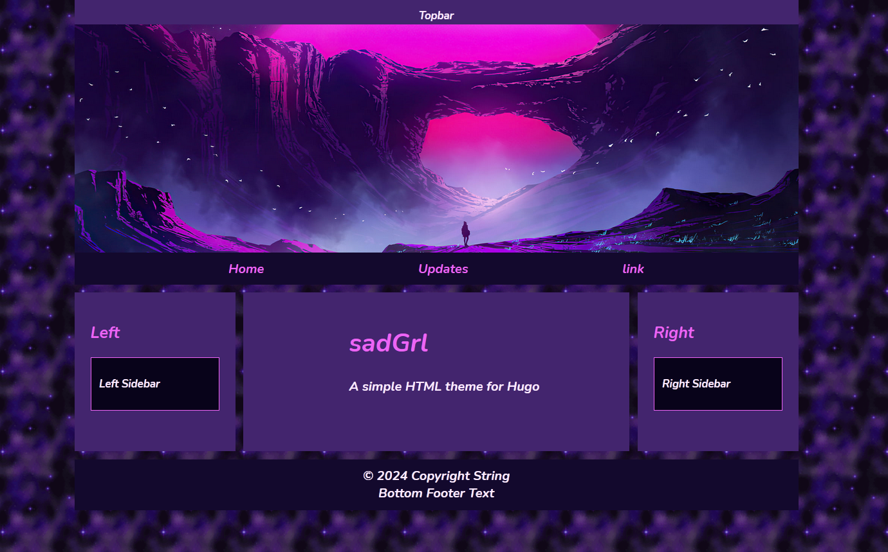
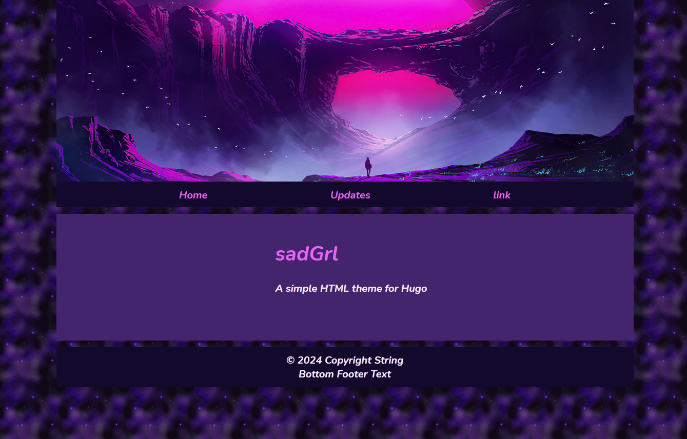
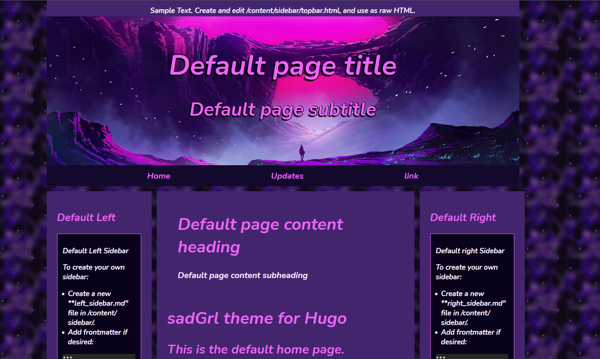

<h1 align="center">sadGrl for Hugo</h1>

<h4 align="center">A Hugo theme for building simple retro websites.</h4>

> sadGrl is a simple theme built out of code generated by *[sadGrl's layout builder](https://goblin-heart.net/sadgrl/projects/layout-builder/)*
>
> The layout builder was created as a jumpstart tool for people to create static sites hosted places like Neocities or Github and ideally learn some HTML and/or CSS in the process.
> 
> The goal of this theme is to replicate the functionality of that tool using Hugo, while offering more variations to people who just want to publish a site.
> 
> I hope it can also serve as a jumpstart for people learning about Hugo and/or static generator tools.

I couldn't find any simple Hugo themes that weren't loaded with interactive tools and javascript frameworks in slick modern interfaces. I don't want to maintain a database, plugins, tools, javascript, comments, blogs, etc. Just make the HTML go to a site like we did in the 90's, except pushed from an automatable workflow. *\</old man yells at cloud...\>*

The default site is built to resemble the layout builder as closeley as possible, including the pink/purple themes and starry background.
However, this is all configurable.

## Features

This recreates the functionaliy of the sadGrl layout builder via hugo.toml settings.
- Topbar on/off
- Navigation bar on/off
- Left and right sidebars separately on/off
- Footer on/off
- Spacing between elements is configurable vs. on/off.

This theme offers additional optional functionality unavailable in the layout builder, which hard-codes a lot of this in the output. No need to change CSS or HTML directly.
- Background image and/or color
- Per-page banner image vs. one global image
- Title and subtitle floated over the banner image
- Font selection for content, page titles and subtitles
- Most element colors
- Content/Sidebar width
- Update content on the home page

---

## Installation

This theme is designed to be as easy as Hugo can get, so I'll be a little pedantic with the instructions.

If you've never used Hugo, there's tons of [Hugo tutorials](https://gohugo.io/getting-started/quick-start/) out there, and most are terrible if you just want to make a website. Follow whichever you'd like to install Hugo, and create your first site using **hugo new site your_website_folder**

Your next step will be installing this theme. You can probably just keep following the tutorial. Don't get too hung up on what a "git submodule" is. It doesn't matter for this theme. It doesn't hurt but there's no reason you can't just download the zip file into your themes folder either. Whatever you prefer.

Once you've got a folder that looks like **/your_website_folder/themes/hugo-sadGrl**, you'll want to copy  **/your_website_folder/themes/hugo-sadGrl/theme.toml** to **/your_website_folder/hugo.toml** The name changes from theme.toml to hugo.toml. (This is to help ensure you keep an original copy of theme.toml.)

At this point, you can cd into **/your_website_folder** and run **hugo server**. 

If that starts without errors, open a browser to localhost:1313, and you should see the site.

All features are enabled by default. The layout is easily customized.

## Configuration

See theme.toml. Most of the general styles can be changed. If you want custom fonts, pop them into your site's static/fonts, and then create CSS blocks to define them.

See theme.toml. Most of the general styles can be changed. If you want custom fonts, pop them into your site's static/fonts, and then create CSS blocks to define them.
